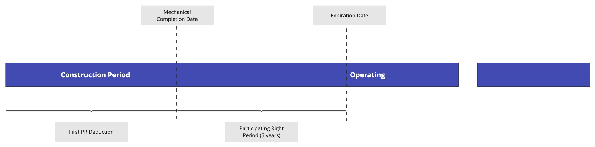

# American Binomial Options

## What is Options?
The term option refers to a financial instrument that is based on the value of underlying securities such as stocks, indexes, and exchange traded funds (ETFs). An options contract offers the buyer the opportunity to buy or sell—depending on the type of contract they hold—the underlying asset. Unlike futures, the holder is not required to buy or sell the asset if they decide against it.
Each options contract will have a specific expiration date by which the holder must exercise their option. The stated price on an option is known as the strike price. 

## What is American Option?
An American option, aka an American-style option, is a version of an options contract that allows holders to exercise the option rights at any time before and including the day of expiration. It contrasts with another type of option, called the European option, that only allows execution on the day of expiration.

## Case Overview
In this project, an infrastructure company make an agreement for selling their stocks based on american binomial option.
The agreement timeline is shown below.

  

The formula for calculation the option price is based on several parameters. Here they are.

- Budgeted Capex Cost = Base Price * (1 + Interest) * FX Adjustment * Incentives * Nameplate Capacity
- Excersie Price = (Budgeted Capex Cost - Capex Loan - Accrued Capex Cost) - First PR Deduction
- Option Price = max[Underlying Asset Value - Excersie Price, 0]
- Valuation Date = Mechanical Completion Date
- Cut Off Date  = 30 Sept 2023

