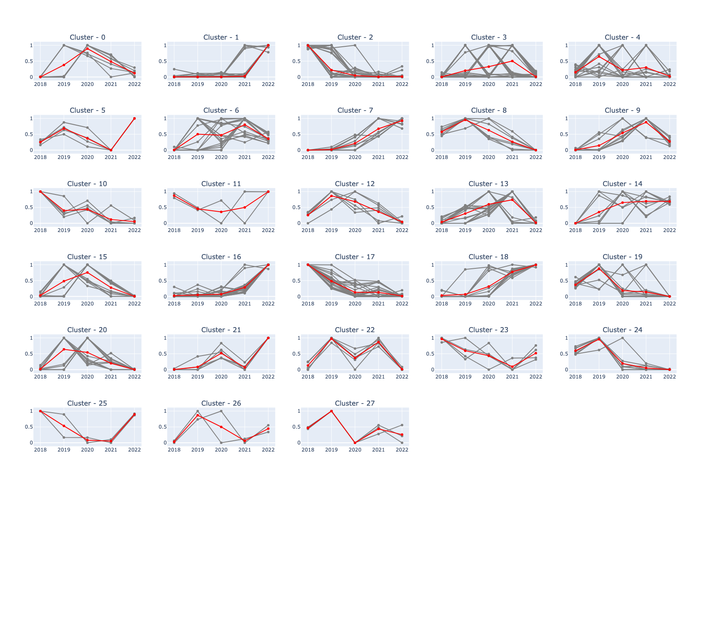
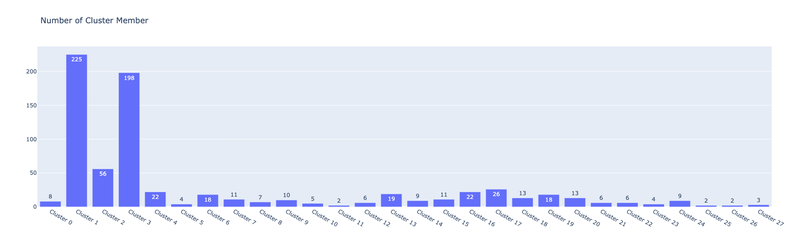
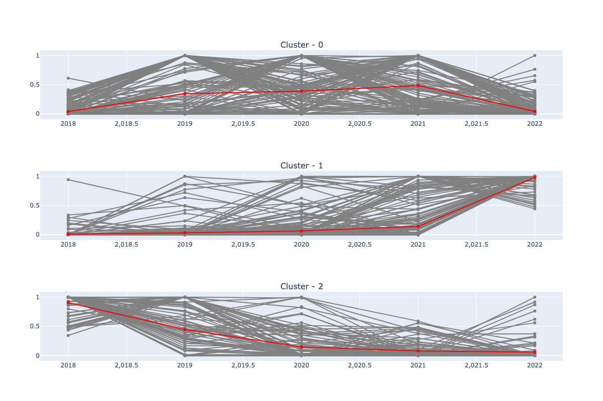
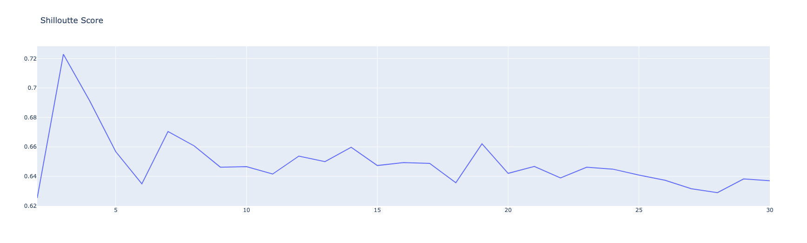

#### Author  : pycodes.id
#### IG      : [Instagram](https://www.instagram.com/pycodes.id/)

## Project Overview
* abc
* def

## Code and Resource
asdad *asdsadsadsd*
* asdad
* asdasd
* 

## Data Sources
sdsdsa
* The data sourced from
* 

## Data Cleaning
asdasdasda
* sdad
* asdsad

## EDA
asdasdsa
* asdasd
* asdasd
* 

## Build Model
asdasdasdsad
* adads
* asdasd

  

'

  

'

  

'

## Model Performance and Evaluation
model performance
* sdasd
* asdsad

  

'

Colons can be used to align columns.

| Tables        | Are           | Cool  |
| ------------- |:-------------:| -----:|
| col 3 is      | right-aligned | $1600 |
| col 2 is      | centered      |   $12 |
| zebra stripes | are neat      |    $1 |

There must be at least 3 dashes separating each header cell.
The outer pipes (|) are optional, and you don't need to make the 
raw Markdown line up prettily. You can also use inline Markdown.

Markdown | Less | Pretty
--- | --- | ---
*Still* | `renders` | **nicely**
1 | 2 | 3

## Deployment
asdsadasd
* adasdsad
* asdsada
